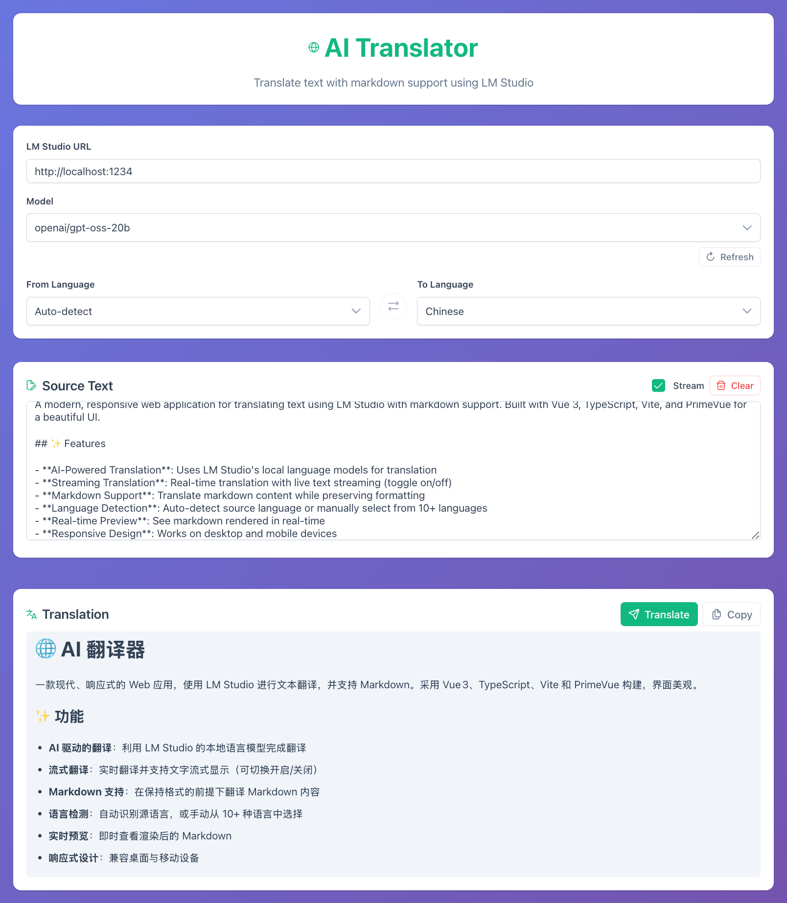

# 🌐 AI Translator




A modern, responsive web application for translating text using LM Studio with markdown support. Built with Vue 3, TypeScript, Vite, and PrimeVue for a beautiful UI.

## ✨ Features

- **AI-Powered Translation**: Uses LM Studio's local language models for translation
- **Streaming Translation**: Real-time translation with live text streaming (toggle on/off)
- **Markdown Support**: Translate markdown content while preserving formatting
- **Language Detection**: Auto-detect source language or manually select from 10+ languages
- **Real-time Preview**: See markdown rendered in real-time
- **Responsive Design**: Works on desktop and mobile devices

## 🚀 Quick Start

### Prerequisites

1. **Install LM Studio**: Download from [lmstudio.ai](https://lmstudio.ai/)
2. **Load a Model**: In LM Studio, download and load a language model (e.g., Llama 2, Mistral, etc.)
3. **Start LM Studio Server**: Click "Start Server" in LM Studio (usually runs on `http://localhost:1234`)

### Installation

1. **Install dependencies**:
   ```bash
   npm install
   ```

2. **Start development server**:
   ```bash
   npm run dev
   ```

3. **Open your browser** and navigate to `http://localhost:5173`

## 🛠️ Setup LM Studio

1. Download and install LM Studio from [lmstudio.ai](https://lmstudio.ai/)
2. Launch LM Studio and go to the "Chat" tab
3. Download a language model (recommended: Mistral 7B, Llama 2 7B, or similar)
4. Load the model by clicking on it
5. Start LM Studio server with `lms server start --cors`

## 🎯 Usage

1. **Configure LM Studio URL** (default: `http://localhost:1234`)
2. **Select languages**: Choose source and target languages
3. **Enable options**: 
   - Toggle **markdown support** if translating markdown content
   - Toggle **stream translation** for real-time text streaming (recommended)
4. **Enter text** in the source text area
5. **Click "Translate"** to get the translation
6. **Watch the translation appear** in real-time (if streaming is enabled)
7. **Copy result** or view the markdown preview

## 🛡️ Troubleshooting

### Common Issues

1. **"Cannot connect to LM Studio"**
   - Make sure LM Studio is running
   - Check that a model is loaded in LM Studio
   - Verify the LM Studio server is started on port 1234

2. **"Translation timeout"**
   - Try with shorter text
   - Check if your model supports the selected languages
   - Restart LM Studio if it's unresponsive

3. **CORS errors**
   - Make sure you start LM Studio server with `--cors` option

## 🤝 Contributing

Feel free to submit issues and pull requests!


## Sponsors

My Open Source works are powered by ❤️, if you like my work, please consider [sponsoring me](https://github.com/sponsors/xiaodong2008).

<a href="https://github.com/xiaodong2008">
  
</a>

## 📄 License

This project is open source and available under the MIT License.